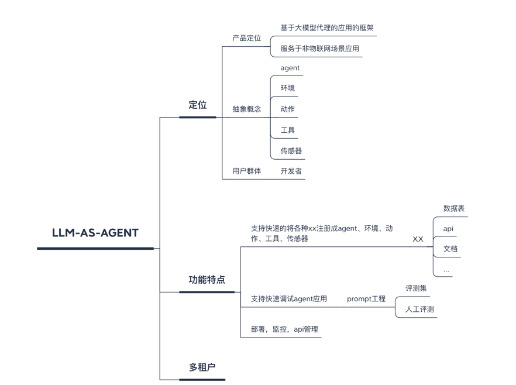

# Smart-Agent

#### 平台简介
策士(Smart Agent)，以开发者为中心，打造基于LLM-AS-Agent + 多租户的快速开发平台，全部开源，个人与企业可 100% 免费使用。

> 有任何问题，或者想要的功能，可以在 Issues 中提给阿坤。
> 
> 😜 给项目点点 Star 吧，这对我们真的很重要！

Java 后端：JDK21 + Spring Boot 3.2.0 + Spring AI
Python 后端：FastApi
管理后台的电脑端：Vue3 提供 element-plus 版本
OneApi: 一个强大而易用的OpenAI接口管理和分发系统
数据库：PostgreSQL 15是一个开源的，特性非常齐全的对象-关系型数据库，同时还支持NoSql的文档型存储；PostgreSQL 适用于 OLTP 和 OLAP 查询；PostgreSQL 15 助力人工智能与向量数据库开启新时代。

#### 开源协议
① 本项目采用比 Apache 2.0 更宽松的 MIT License 开源协议，个人与企业可 100% 免费使用，不用保留类作者、Copyright 信息。
② 代码整洁、架构整洁，遵循《阿里巴巴 Java 开发手册》规范，代码注释详细。

#### 安装教程

1.  xxxx
2.  xxxx
3.  xxxx

#### 使用说明

1.  xxxx
2.  xxxx
3.  xxxx

### 系统功能

| 功能    | 描述                              |
|-------|---------------------------------|
| 用户管理  | 用户是系统操作者，该功能主要完成系统用户配置          |
| 在线用户  | 当前系统中活跃用户状态监控，支持手动踢下线           |
| 角色管理  | 角色菜单权限分配、设置角色按机构进行数据范围权限划分      |
| 菜单管理  | 配置系统菜单、操作权限、按钮权限标识等，本地缓存提供性能    |
| 部门管理  | 配置系统组织机构（公司、部门、小组），树结构展现支持数据权限  |
| 岗位管理  | 配置系统用户所属担任职务                    |
| 租户管理  | 配置系统租户，支持 SaaS 场景下的多租户功能        |
| 租户套餐  | 配置租户套餐，自定每个租户的菜单、操作、按钮的权限       |
| 字典管理  | 对系统中经常使用的一些较为固定的数据进行维护          |
| 操作日志  | 系统正常操作日志记录和查询，集成 Swagger 生成日志内容 |
| 登录日志  | 系统登录日志记录查询，包含登录异常               |
| 错误码管理 | 系统所有错误码的管理，可在线修改错误提示，无需重启服务     |
| 敏感词   | 配置系统敏感词，支持标签分组                  |
| 应用管理  | 管理 SSO 单点登录的应用，支持多种 OAuth2 授权方式 |
| 标签管理  | 管理数据集、用户画像的等通用标签                |

### 基础设施

| 功能     | 描述                                           |
|--------|----------------------------------------------|
| 代码生成   | 前后端代码的生成（Java、Vue、SQL、单元测试），支持 CRUD 下载       |
| 系统接口   | 基于 Swagger 自动生成相关的 RESTful API 接口文档          |
| 数据库文档  | 基于 Screw 自动生成数据库文档，支持导出 Word、HTML、MD 格式      |
| 表单构建   | 拖动表单元素生成相应的 HTML 代码，支持导出 JSON、Vue 文件         |
| 配置管理   | 对系统动态配置常用参数，支持 SpringBoot 加载                 |
| 定时任务   | 在线（添加、修改、删除)任务调度包含执行结果日志                     |
| SSE    | 提供 Server-Sent Events 接入示例，支持一对一实时推送方式              |
| API 日志 | 包括 RESTful API 访问日志、异常日志两部分，方便排查 API 相关的问题   |
| 消息队列   | 基于 Redis 实现消息队列，Stream 提供集群消费，Pub/Sub 提供广播消费 |
| 链路追踪   | 接入 SkyWalking 组件，实现链路追踪                      |
| 日志中心   | 接入 SkyWalking 组件，实现日志中心                      |
| 分布式锁   | 基于 Redis 实现分布式锁，满足并发场景                       |
| 幂等组件   | 基于 Redis 实现幂等组件，解决重复请求问题                     |
| 服务保障   | 基于 sentinel 实现服务的稳定性，包括限流、熔断等功能          |
| 日志服务   | 轻量级日志中心，查看远程服务器的日志                           |
| 单元测试   | 基于 JUnit + Mockito 实现单元测试，保证功能的正确性、代码的质量等    |

#### 参与贡献

1.  Fork 本仓库
2.  新建 Feat_xxx 分支
3.  提交代码
4.  新建 Pull Request

#### 特技

1.  使用 Readme\_XXX.md 来支持不同的语言，例如 Readme\_en.md, Readme\_zh.md
2.  Gitee 官方博客 [blog.gitee.com](https://blog.gitee.com)
3.  你可以 [https://gitee.com/explore](https://gitee.com/explore) 这个地址来了解 Gitee 上的优秀开源项目
4.  [GVP](https://gitee.com/gvp) 全称是 Gitee 最有价值开源项目，是综合评定出的优秀开源项目
5.  Gitee 官方提供的使用手册 [https://gitee.com/help](https://gitee.com/help)
6.  Gitee 封面人物是一档用来展示 Gitee 会员风采的栏目 [https://gitee.com/gitee-stars/](https://gitee.com/gitee-stars/)
